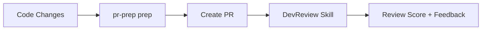

# PR Prep

[](https://github.com/LanNguyenSi/pr-prep/actions/workflows/ci.yml)
[](https://www.npmjs.com/package/pr-prep)
[](https://opensource.org/licenses/MIT)

CLI tool to prepare pull requests with pre-flight checks and auto-generated descriptions.

Perfect complement to [DevReview](https://github.com/openclaw/openclaw/tree/master/skills/devreview) OpenClaw Skill!

## Features

✅ **Pre-flight Checks:**
- Branch validation (not on main/master)
- No uncommitted changes
- TypeScript compilation
- Linting
- Code formatting
- Test execution

✅ **Auto-Generated PR Descriptions:**
- Title from commit message or branch name
- Summary from commits
- Changed files categorized (source/tests/docs/config)
- Testing checklist
- Template for additional context

✅ **Smart Defaults:**
- Skips checks if scripts don't exist
- Fast mode for quick validation
- Option to skip tests
- Configurable output

## Installation

```bash
npm install -g pr-prep
```

Or use directly with `npx`:

```bash
npx pr-prep prep
```

## Usage

### Full Preparation (checks + description)

```bash
pr-prep prep
```

Options:
- `-s, --skip-tests` - Skip running tests
- `-f, --fast` - Skip slow checks (linting, formatting, tests)
- `--no-push` - Don't push to remote after checks

### Checks Only

```bash
pr-prep check
```

Runs all pre-flight checks without generating PR description.

### Description Only

```bash
pr-prep describe
```

Generate PR description without running checks.

Save to file:
```bash
pr-prep describe -o PR_DESCRIPTION.md
```

## Examples

### Standard Workflow

```bash
# 1. Make changes and commit
git add .
git commit -m "feat: Add user authentication"

# 2. Prepare PR
pr-prep prep

# 3. Create PR on GitHub with generated description
gh pr create --body "$(pr-prep describe)"
```

### Quick Check Before Commit

```bash
# Run checks without generating description
pr-prep check --fast
```

### Generate Description After Manual Testing

```bash
# Run checks
pr-prep check

# Manually test your changes
npm run dev

# Generate description
pr-prep describe -o PR_DESC.md

# Create PR
gh pr create --body-file PR_DESC.md
```

## Pre-flight Checks

### 1. Branch Validation
Ensures you're not creating a PR from `main` or `master` branch.

### 2. Uncommitted Changes
Verifies all changes are committed before prep.

### 3. TypeScript Compilation
Runs `npm run typecheck` or `npm run tsc` if available.

### 4. Linting
Runs `npm run lint` if available.

### 5. Code Formatting
Runs `npm run format:check` if available.

### 6. Tests
Runs `npm test` if available.

**Note:** Checks are skipped gracefully if corresponding npm scripts don't exist.

## Generated PR Description Format

````markdown
# Feature Title

## Summary

This PR includes 3 commits:
- feat: Add authentication API (`abc123`)
- test: Add auth tests (`def456`)
- docs: Update API docs (`ghi789`)

## Changed Files

**Source:**
- `src/auth/auth.service.ts`
- `src/auth/auth.controller.ts`

**Tests:**
- `src/auth/auth.service.test.ts`

**Documentation:**
- `README.md`

## Testing

- [ ] Unit tests pass
- [ ] Integration tests pass
- [ ] Manual testing completed
- [ ] No regressions

## Additional Context

<!-- Add screenshots, notes, etc. -->
````

## Integration with DevReview

**PR Prep** prepares PRs before review, **DevReview** scores them after creation:



**Workflow:**
1. Developer: `pr-prep prep` (pre-flight checks + description)
2. Developer: Create PR with generated description
3. DevReview: Automatically scores PR (1-10) with structured feedback
4. Developer: Address feedback and iterate

Together they create a complete PR lifecycle!

## Configuration

No configuration file needed. `pr-prep` detects your project setup automatically:
- Checks for `package.json`
- Runs npm scripts if available
- Skips checks gracefully if not applicable

## Requirements

- Node.js 18+
- Git
- npm (if project has `package.json`)

## Development

```bash
# Clone repo
git clone <repo-url>
cd pr-prep

# Install dependencies
npm install

# Run in dev mode
npm run dev -- prep

# Build
npm run build

# Test
npm test
```

## License

MIT

## Author

Lava 🌋

## Related

- [DevReview OpenClaw Skill](https://github.com/openclaw/openclaw/tree/master/skills/devreview) - PR review scoring
- [OpenClaw](https://github.com/openclaw/openclaw) - AI agent platform
